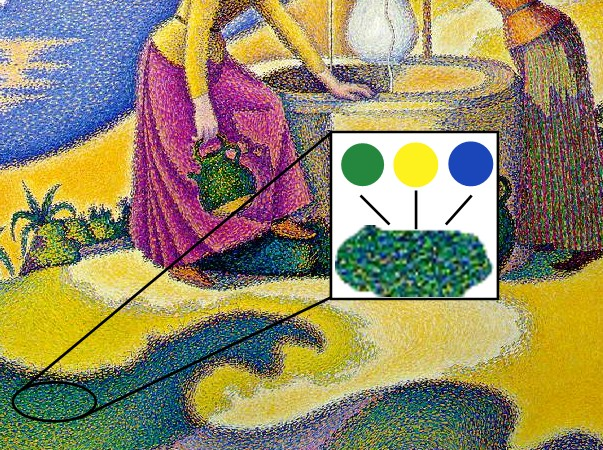
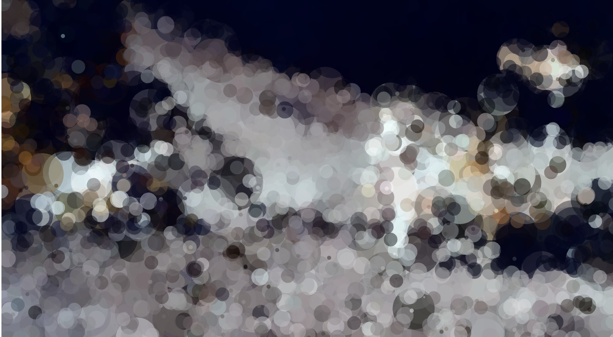

# Quiz 8
## Part 1: Imaging Technique Inspiration
### Pointillism Painting
  
  *Georges Seurat's "A Sunday Afternoon on the Island of La Grande Jatte"*

I am inspired by pointillism, especially the work of Georges Seurat. Pointillism is the use of small dots of solid color to create an image. Georges Seurat and Paul Signac developed the technique. 

Pointillism and programming complement each other, mainly because both rely on many small elements (such as dots or pixels) to build a complex image. 

  

*Paul Signac, Femmes au Puits, 1892, showing a detail with constituent colors. Musée d'Orsay, Paris*

Through programming, the artist can precisely control the color, size and position of each dot, resulting in complex effects and dynamics. In addition, programming can incorporate Perlin noise and randomness, using these techniques to drive animation effects and add a sense of dynamism to the work.

## Part 2: Coding Technique Exploration
To achieve the pointillism effect programmatically, I found a coding technique using Processing, a visual programming language and environment. The technique involves sampling an image's pixels and drawing circles (dots) at varying positions, sizes, and colors based on the pixel data. This approach helps recreate the pointillism effect by programmatically placing dots to form an image.
An example implementation can be found here, including sample code: [linketext](https://processing.org/examples/pointillism.html)

Here's how the technique contributes to the desired effect:

**Pixel Sampling**: The code samples pixels from an input image to get color data.

**Dot Drawing**: It draws circles (dots) at random or structured positions using the sampled colors.

**Dynamic Visualization**: Adjusting dot sizes and positions can create different artistic effects.

  
  *Screenshot of pointillism effect generated in Processing*

